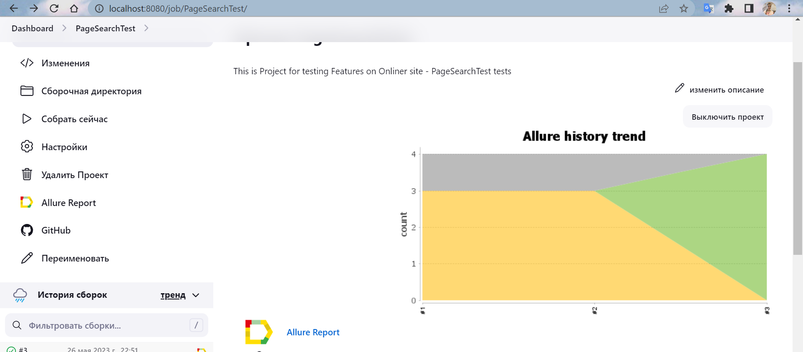
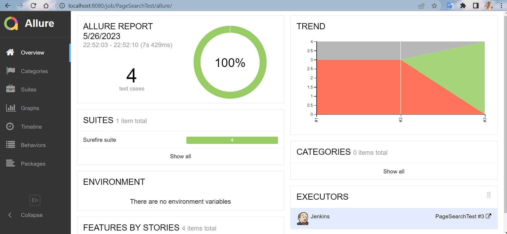
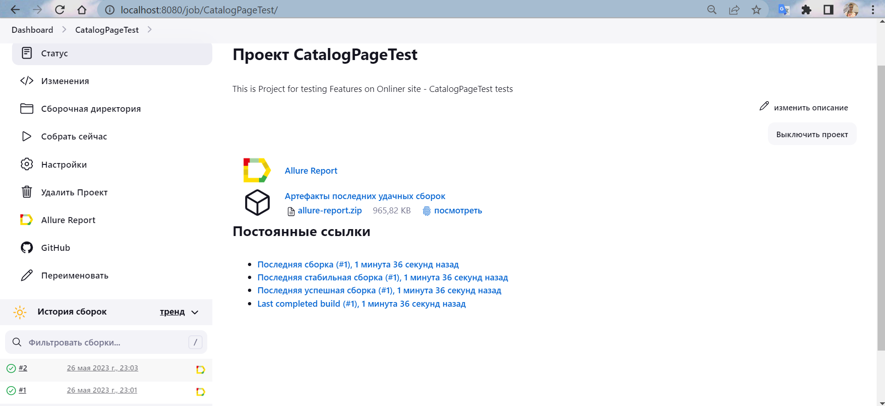
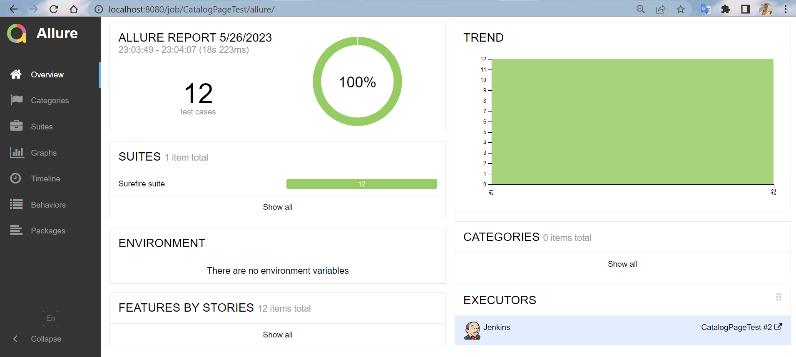

Реализовать следующие тест-кейсы для онлайнера
1. открыть раздел каталог, проверить присутствие секций "Электроника", "Компьютеры и сети",
   "Бытовая техника", "На каждый день", "Стройка и ремонт",
   "Дом и сад","Авто и мото","Красота и спорт","Детям и мамам".

2. открыть секцию каталога "Компьютеры и сети". Убедиться, что появляется вертикальный список пунктов секции и присутствуют как минимум
   пункты "Ноутбуки,компьютеры, мониторы","Комплектующие"...

3. Открыть пункт "Комплектующие". Проверить, что в появившемся списке комплектующих ВСЕ элементы
   содержат название, количество товаров и минимальную цену.

4. Выбрать любой товар, напр. Электроника->Аудиотехника->Наушники. Проверить
   список товаров: наличие их тайтлов, описания, рейтинг, цен, иконок, чекбоксов.

Все тесты должны быть независимы друг от друга.

Реализовать следующие тест-кейсы для онлайнера

1. Перевести проект Selenium на Selenide
2. Протестировать форму поиска/поиск на onliner. Тест кейсы придумываете самостоятельно.
Их должно быть минимум 3.

ДЗ-8

Часть 1 - Rest Assured:
1) Перейти на страницу https://catalog.onliner.by/sushivesla
   Воспроизвести запрос на эндпоинт https://catalog.onliner.by/sdapi/catalog.api/search/sushivesla
   с помощью Rest Assured
   Полученный ответ необходимо конвертировать в список объектов Product.
   Каждый объект содержит поля:
   id
   key
   name
   full_name

Проверить, что каждое полученное имя не пустое.

2) На той же странице выбрать любой фильтр (например роллы), отследить запрос
   и воспроизвести его с помощью Rest Assured.
   Необходимо проверить, что все name_prefix из респонса содержат выбранный фильтр ("Роллы")
   Нет необходимости конвертироваться весь респолс в объект, достаточно по json path
   достать список этих name_prefix.

Тесты должны находится в одном из проектов (Selenide, Selenium или BDD TAF) - в том, который вы выбрали для себя основным.

Часть 2:
Необходимо в одном из проектов (Selenide, Selenium или BDD TAF) сконфигурировать запуск тестов на разных
браузерах (chrome, firefox, edge - минимум 2). Также должна быть предусмотрена возможность запуска тестов на
удаленной машине (selenium grid)

ДЗ-9

1) Реализовать логирование в вашем основном фреймворке. Использовать инструмент slf4j.
2) Установить дженкинс,реализовать запуск тестов на дженкенсе. В конце прохождения тестов должен гененироваться отчет. (подключить в дженкинс плагин Allure)
   Run 1

  

Run 2

 
